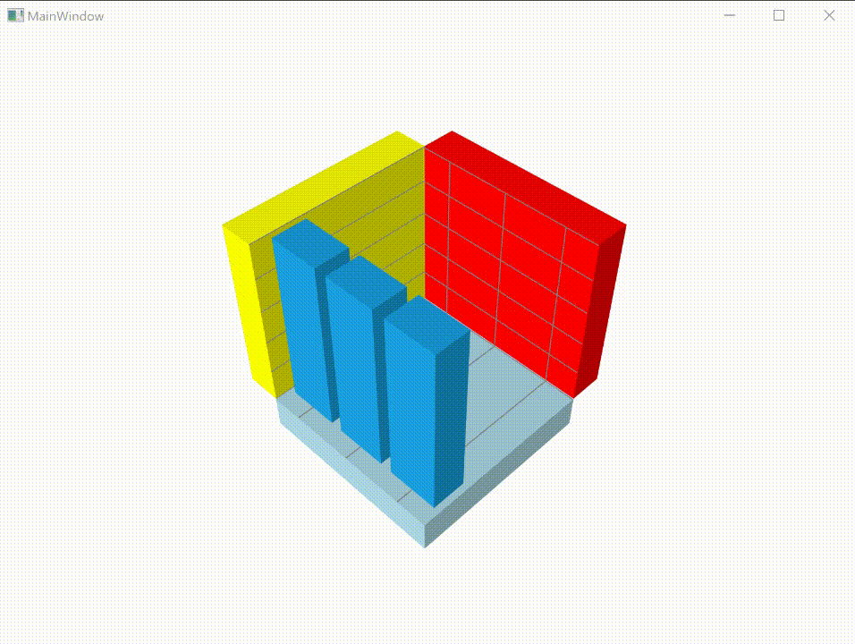

# How-to-customize-the-background-color-and-size-of-WPF-3D-chart
This article explains how to customize the background color and size of the 3D chart wall in Syncfusion WPF SfChart as shown in the following image.

This can be achieved by setting the desired brush color to the wall and to change the size of the wall by using the property WallSize as shown in below code snippet.

**[XAML]**

```
    <Syncfusion:SfChart3D 
        x:Name="Chart" 
        BackWallBrush="Red"
        BottomWallBrush="LightBlue"
        LeftWallBrush="Yellow"
        RightWallBrush="Maroon"
        WallSize="50"
        TopWallBrush="Green" 
        Height="300" Width="300"
        SideBySideSeriesPlacement="False" 
        EnableRotation="True" 
        Rotation="45" BorderThickness="7"
        Tilt="45" >

        <Syncfusion:SfChart3D.DataContext>
            <local:ViewModel/>
        </Syncfusion:SfChart3D.DataContext>
        <Syncfusion:SfChart3D.PrimaryAxis>
            <Syncfusion:NumericalAxis3D Minimum="0.5" TickLineSize="0" LabelCreated="NumericalAxis3D_LabelCreated" Interval="1" >
            </Syncfusion:NumericalAxis3D>
        </Syncfusion:SfChart3D.PrimaryAxis>

        <Syncfusion:SfChart3D.SecondaryAxis>
            <Syncfusion:NumericalAxis3D Minimum="0" TickLineSize="0" LabelCreated="NumericalAxis3D_LabelCreated" Maximum="100">
            </Syncfusion:NumericalAxis3D>
        </Syncfusion:SfChart3D.SecondaryAxis>

        <Syncfusion:SfChart3D.DepthAxis>
            <Syncfusion:NumericalAxis3D  Interval="0"/>
        </Syncfusion:SfChart3D.DepthAxis>
        <Syncfusion:ColumnSeries3D ItemsSource="{Binding GrowthDetails}"  XBindingPath="Product" YBindingPath="Revenue"/>

    </Syncfusion:SfChart3D >
```


**See also**

[How to display the axis labels in a particular format](https://www.syncfusion.com/kb/3318/how-to-display-the-axis-labels-in-a-particular-format)

[How to define ticker labels of custom axis](https://www.syncfusion.com/kb/2588/how-to-define-ticker-labels-of-custom-axis)

[How to display the visible range of labels while zooming](https://www.syncfusion.com/kb/2712/how-to-display-the-visible-range-of-labels-while-zooming)


